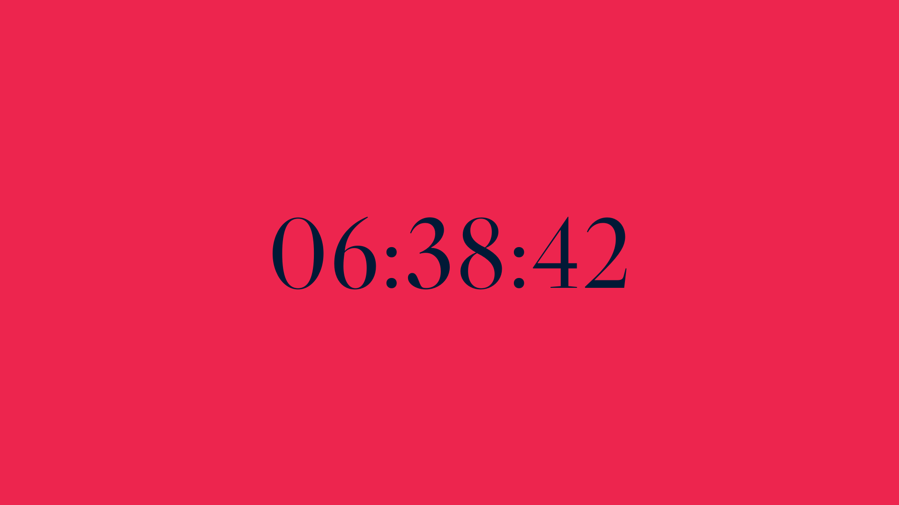
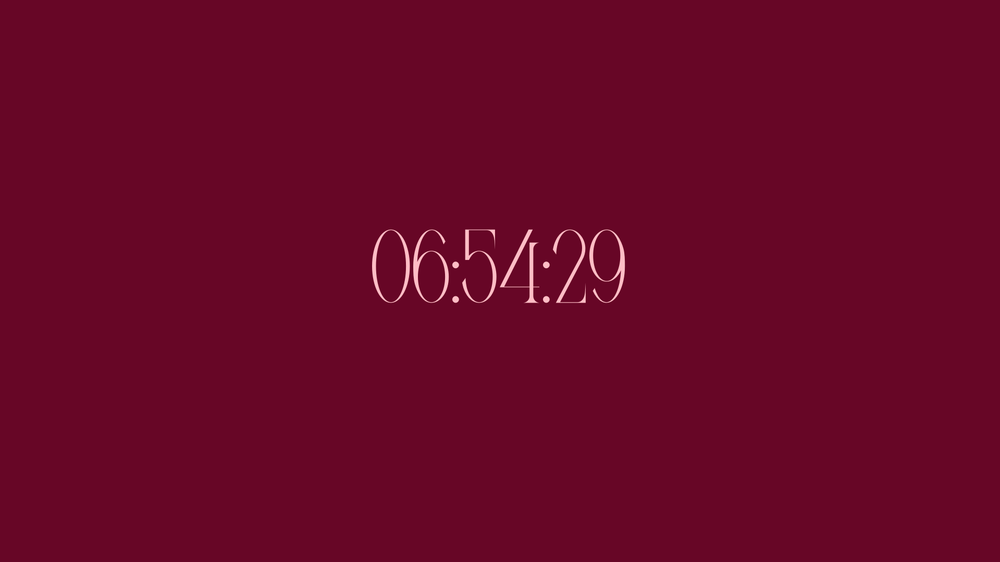

> 📌 Note  
> Some of these fonts are licensed, so i cant include them in the repo  
> However, the names of these fonts are given :D

 

<table width="100%">
<tr>
    <td width="50%"></td>
    <td width="50%"></td>
</tr>
<tr>
    <td width="50%"><pre><code>{
    "foreground": "#0093af",
    "background": "#edcdc2",
    "font": "AgokaFamily.otf",
    "fontSize": 80
}</code></pre></td>
    <td width="50%"><pre><code>{
    "foreground": "#efe6de",
    "background": "#dd3a44",
    "font": "RobotoCondensed-VariableFont_wght.ttf",
    "fontSize": 80
}</code></pre></td>
</tr>
<tr>
    <td width="50%"></td>
    <td width="50%"></td>
</tr>
<tr>
    <td width="50%"><pre><code>{
    "foreground": "#011936",
    "background": "#ed254e",
    "font": "font.ttf",
    "fontSize": 160
}</code></pre></td>
    <td width="50%"><pre><code>{
    "foreground": "#fdf9f2",
    "background": "#1d56cf",
    "font": "Wolfgang.ttf",
    "fontSize": 300
}</code></pre></td>
</tr>
<tr>
    <td width="50%"></td>
    <td width="50%"></td>
</tr>
<tr>
    <td width="50%"><pre><code>{
    "foreground": "#0093af",
    "background": "#edcdc2",
    "font": "Vis-A-Vis.ttf",
    "fontSize": 200
}</code></pre></td>
    <td width="50%"><pre><code>{
    "foreground": "#f6c6c2",
    "background": "#62709f",
    "font": "twister.ttf",
    "fontSize": 200
}</code></pre></td>
</tr>
<tr>
    <td width="50%"></td>
    <td width="50%"></td>
</tr>
<tr>
    <td width="50%"><pre><code>{
    "foreground": "#ffbdc5",
    "background": "#670626",
    "font": "Meglona.otf",
    "fontSize": 110
}</code></pre></td>
    <td width="50%"><pre><code>{
    "foreground": "#434038",
    "background": "#f9f6e6",
    "font": "xenosphere.otf",
    "fontSize": 110
}</code></pre></td>
</tr>
</table>
